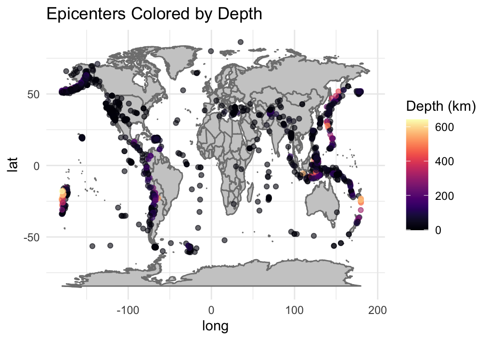

# Earthquake Visualization & Analysis
A comprehensive R script that fetches global earthquake data (M ≥ 2.5 over the past 30 days) from the USGS and generates a suite of 15 exploratory and analytical plots, including mapping, distributional summaries, time-series, heatmaps, and a regression analysis.

## Table of Contents

1. [Project Overview](#project-overview)
2. [Features & Plots](#features--plots)
3. [Prerequisites](#prerequisites)
4. [Installation](#installation)
5. [Usage](#usage)
6. [Script Breakdown](#script-breakdown)
7. [Interpreting the Outputs](#interpreting-the-outputs)
8. [Extending & Customizing](#extending--customizing)
9. [Data Source & Citations](#data-source--citations)
10. [License](#license)

## Project Overview

This project provides a single, self-contained R script (`Earthquake.R`) that:

* **Automatically installs** required packages if missing
* **Downloads** 30 days of earthquake events (M ≥ 2.5) from USGS
* **Cleans & enriches** the dataset (timestamps, categories, top locations)
* **Renders 15 visualizations** to explore spatial, temporal, and statistical patterns
* **Performs** a simple linear regression of magnitude on depth, printing model metrics

All plots display in sequence when you run the script in R (or RStudio). Ideal for researchers, data analysts, or enthusiasts who want a quick, reproducible overview of recent seismic activity.

## Features & Plots

1. **Epicenter Map**

   * Size and color scaled by magnitude
2. **Depth‐Colored Map**

   * Points shaded by earthquake depth
3. **Magnitude Histogram**
4. **Magnitude Density Plot**
5. **Depth Histogram**
6. **Depth by Magnitude Category** (Boxplot)
7. **Magnitude vs. Depth** (LOESS smoothing)
8. **Daily Quake Counts** (Time-series)
9. **Weekly Hourly Heatmap**
10. **Cumulative Quake Count**
11. **Top 10 Reported Locations** (Bar chart)
12. **Magnitude by Weekday** (Violin plot)
13. **Faceted Epicenter Map** (By magnitude category)
14. *(Repeated placeholder for consistency – see #13)*
15. **Regression Analysis**

    * Linear model of `mag ~ depth`
    * Prints summary (coefficients, R², p-values)
    * Scatter plot with regression line & annotation

<p align="center">
  
</p>

<p align="center">
  
</p>

<p align="center">
  
</p>

<p align="center">
  
</p>

<p align="center">
  
</p>

<p align="center">
  
</p>

<p align="center">
  
</p>

<p align="center">
  
</p>

<p align="center">
  
</p>

<p align="center">
  
</p>

_and more..._

## Prerequisites

* **R** (≥ 4.0) installed on your system
* Internet connection to fetch data from USGS

### R Packages

* `ggplot2`
* `maps`
* `ggmap`
* `dplyr`
* `lubridate`
* `scales`
* `viridis`
* `tidyr`
* `forcats`

The script will automatically install any missing packages.

## Installation

1. **Clone or download** this repository to your local machine.
2. Ensure you have **R** installed. If using **RStudio**, open the project there.

*No additional dependencies or build steps are required.*

## Usage

1. Open R or RStudio.
2. Set your working directory to the project folder:

   ```r
   setwd("path/to/project")
   ```
3. Source or run the script:

   ```r
   source("Earthquake.R")
   ```

   or open the file in the RStudio editor and click **“Run All”**.
4. Watch the console output print the regression summary, and view each of the 15 plots in sequence.

## Script Breakdown

1. **Setup**

   * Defines package list and auto-installs missing ones
   * Loads all libraries

2. **Data Fetch & Preparation**

   * Downloads `2.5_month.csv` from USGS
   * Parses `time` to POSIXct and derives `date`, `hour`, `weekday`
   * Bins magnitudes into categories and extracts top 10 “places”

3. **Plotting Sections**

   * **2–3:** Two world‐map visualizations
   * **4–7:** Distribution and relationship plots (histograms, density, boxplot, scatter)
   * **8–10:** Time‐based analyses (daily counts, heatmap, cumulative)
   * **11–12:** Categorical summaries (bar chart of top locations, violin by weekday)
   * **13:** Faceted spatial view by magnitude bin
   * **15:** Regression of magnitude on depth with summary and annotated plot

Each plot is constructed with `ggplot2` and printed via `print()`, ensuring they render in non-interactive R consoles or RMarkdown.

## Interpreting the Outputs

* **Maps (p1–p3, p13):** Reveal geographic clustering, depth patterns, and high-magnitude zones.
* **Histograms & Density (p3–p5):** Show the frequency distribution of earthquake magnitudes and depths.
* **Boxplot (p6):** Illustrates depth variability across magnitude bins.
* **Scatter & Regression (p7 & p15):** Visualize and quantify the relationship between depth and magnitude; check R² and p-value.
* **Time-series (p8, p10):** Track daily counts and overall accumulation to detect temporal trends.
* **Heatmap (p9):** Highlights diurnal and weekday patterns in earthquake occurrence.
* **Top Locations & Violin (p11–p12):** Identify frequently reported locations and compare magnitude distributions by weekday.

## Extending & Customizing

* **Bin sizes:** Adjust `binwidth` in histograms.
* **Color palettes:** Swap `viridis` options or use custom color scales.
* **Additional regressions:** Try `mag ~ log(depth)` or include other predictors (e.g., latitude, longitude).
* **Faceting:** Create facets by day, region, or magnitude threshold.
* **Saving plots:** Add `ggsave()` calls after any `print(pX)` if you wish to export to PNG/PDF.

## Data Source & Citations

* **USGS Earthquake Feeds**:

  * 2.5+ magnitude earthquakes in the past 30 days:
    `https://earthquake.usgs.gov/earthquakes/feed/v1.0/summary/2.5_month.csv`
* **R & Packages**:

  * R Core Team (2023). R: A language and environment for statistical computing.
  * Wickham et al. for `ggplot2`, `dplyr`, `tidyr`, etc.
  * Viridis developers for colorblind-friendly palettes.

## License

This project is distributed under the MIT License. See **LICENSE** for full terms.
